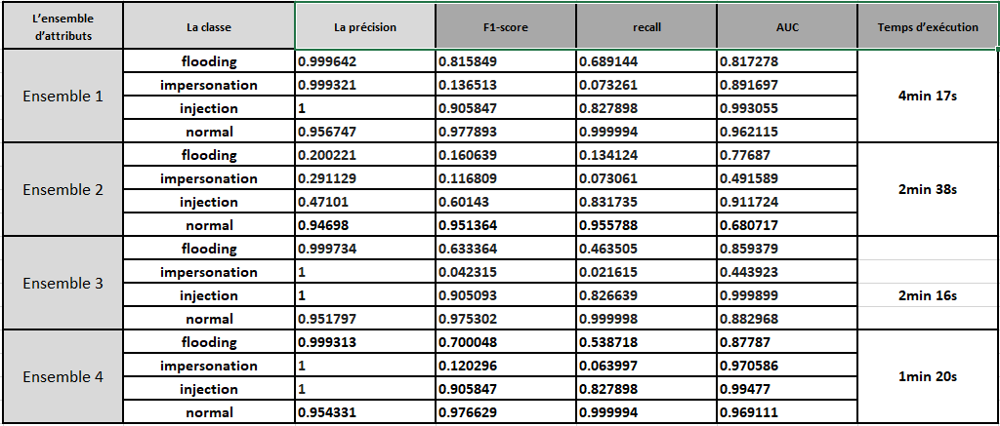
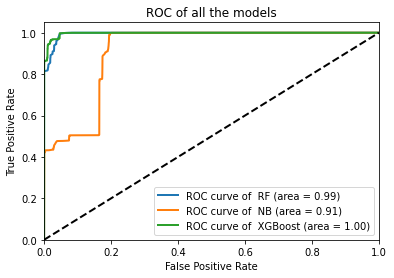

# AWID network anomaly detection and attack classification using ML
The present work aims to design and produce a tool based on machine learning for the detection of anomalies in an Iot network.

## Key words 
    Machine Learning, ML, Classification, Iot, Network anomalies, attacks detection.
# Dataset
We chose to work on the **AWID**dataset, which is a collection of publicly available datasets in an easily distributable format. It includes Wi-Fi network data collected from the network environments.

We worked on the **AWID-CLS-R** dataset. This dataset contains two files **AWID-CLS-R-Trn** and **AWID-CLS-R-Tst**, which are the training set and the test data set, respectively, each record is represented by a vector of 156 attributes.the file *col_names.txt* represents the list of all the attributes.

The reduced dataset **AWID-CLS-R** contains three categories of attacks: flooding, impersonation, injection.
# Classification Algorithms
* Random forest
* Naive-Bayes
* XGBoost
# Technical work
+ Add headers to data
+ Clean the data
+ Remove unimportant columns 
+ Fix the missing data replace them with the median
+ Scale the vars
+ Feature selection (three sets + the original dataset)
+ Classification

# Results
The random forest classifier gives the better results:

# More
for more details check [my report](./Report_Mahamdi.pdf) (writing in french) and the [presentation](https://mahamdiamine.github.io/PFE-presentation/index.html)
